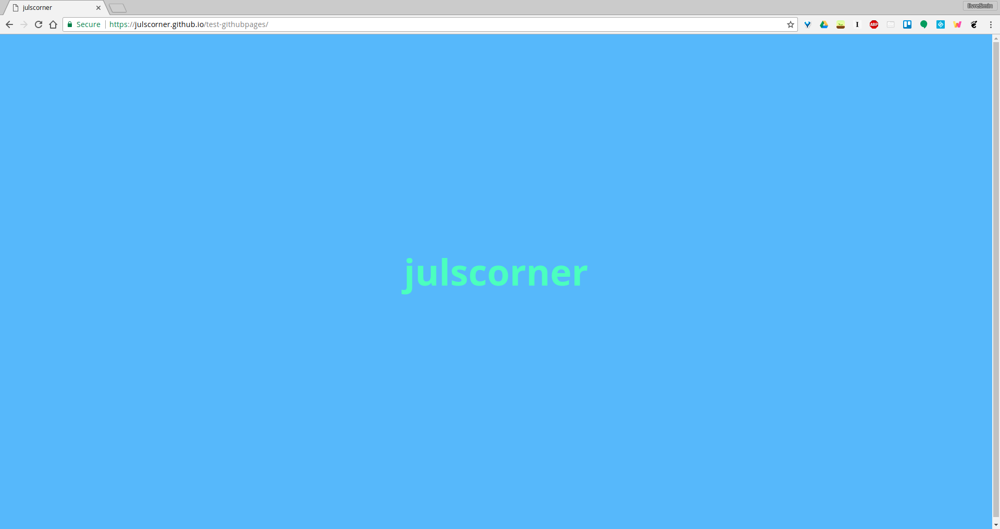

# mini-project: test-githubpages

To me the goal was to try GitHub Pages. See the [live demo](https://julscorner.github.io/test-githubpages/).

## The result

## Thanks
I was inspired by [@sanjaypojo](https://github.com/sanjaypojo/15-min-me) who made an efficient tutorial on Medium ["Build and launch a custom personal website in 15 minutes"](https://hackernoon.com/build-and-launch-a-custom-personal-website-in-15-minutes-1aaa868b1216).
I just followed his tutorial.

## Takeways learned
- [why css -if added to html- CSS should be added to the head tag and not the body tag](https://stackoverflow.com/questions/1642212/whats-the-difference-if-i-put-css-file-inside-head-or-body)?
- how to style a readme.md in a very basic way, [see this gist](https://gist.github.com/PurpleBooth/109311bb0361f32d87a2).
  Click on 'raw' button to see the md styling.

